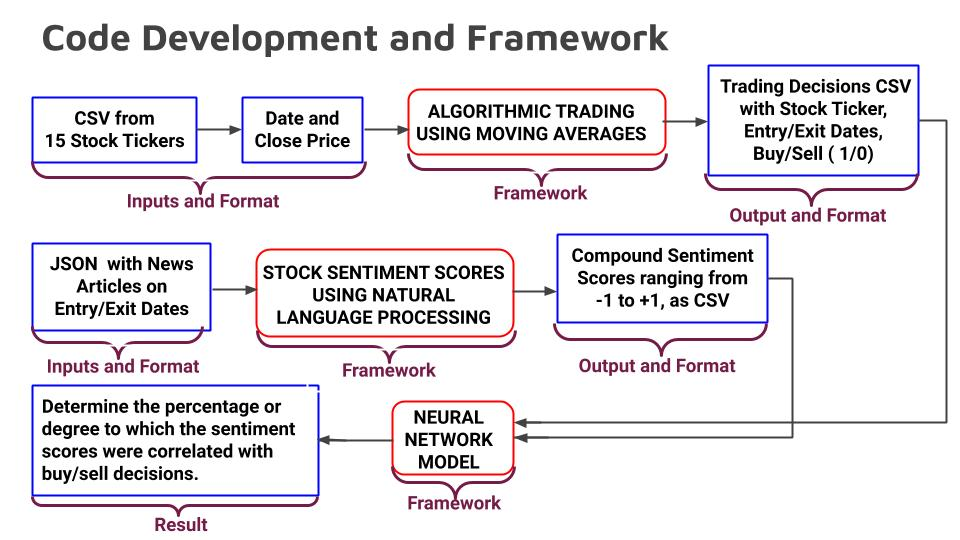
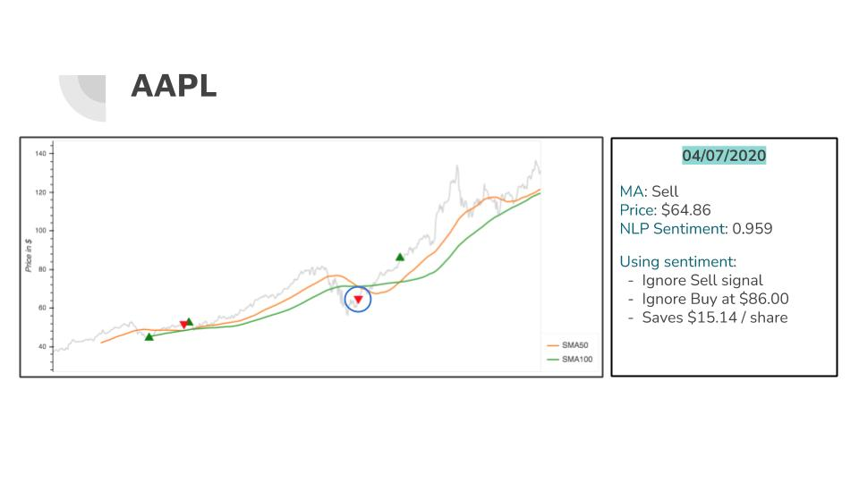
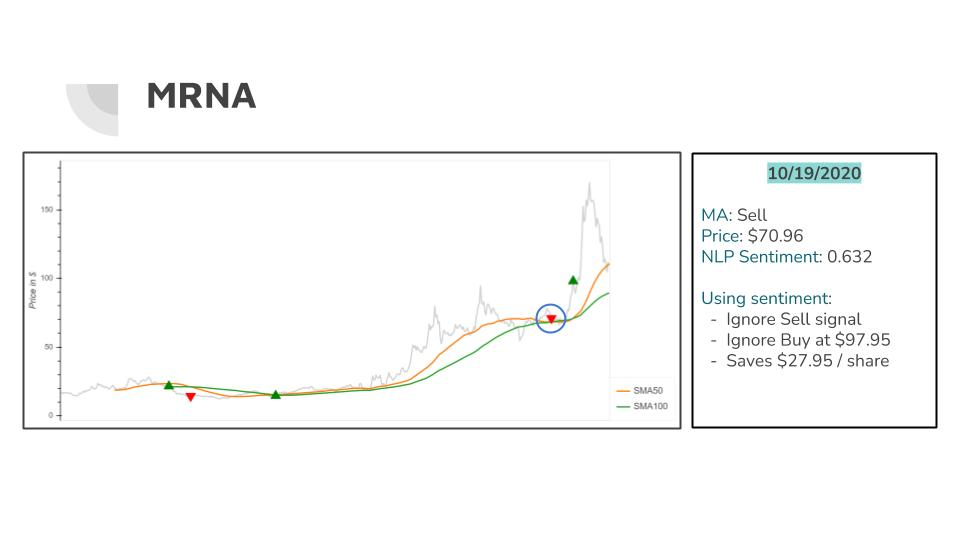
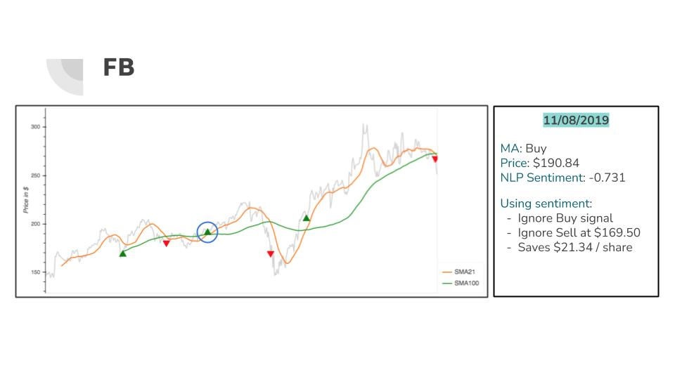

# "Talk Algo to Me": Project Summary
*Applying Algorithmic Trading and Natural Language Processing for better investment decisions.*

## Motivation
Our motivation for this project stems from the need to supplement *traditional trading methods* with *machine learning and deep learning techniques* to make **better trading decisions as investors**.
We were interested in combining a technical analysis of a stock with the overall sentiment of it, and we chose stocks that interested us. 

## Plan of Action
**What was our goal?** To test the effectiveness of Natural Language Processing (NLP) in supplementing Algorithmic Trading Decisions.

**Steps**
1. Choose four stocks to use in different sectors, then others for comparison. 
2. Determine the period combinations of moving averages we want to use.
3. Apply Algorithmic Trading to determine buy/sell/hold trade decisions on stocks.
4. Apply NLP on news articles centered around the trading day to obtain sentiment scores.
5. Combine NLP sentiment scores with Algorithmic Trading results to make better trading decisions for investors.

## Tickers
We wanted to pick four starter tickers in different sectors such as:
- **Technology** - Apple (AAPL)
- **Cryptocurrency** - Bitcoin (BTC)
- **Healthcare** - Moderna (MRNA)
- **Bonds** - Ten Year Treasury Bond (TNX)

Then we added other stocks to use in our models such as: Amazon (AMZN), Facebook (FB), Gold (GOLD), Google (GOOG), JPMorgan Chase & Co. (JPM), Mastercard (MA), Microsoft (MSFT), Silver (SLV), Tesla (TSLA), Twitter (TWTR), and Visa (V).

## Coding Development, Framework, and Implementation
Here is a visual of our development process.

## Algorithmic Trading Framework Implementation: Steps
1. Importing Libraries  and Dependencies: numpy, pandas, hvplot, pathlib, and matplotlib.
2. Inputing parameters and a utility script called the “trade_evaluation” function to generate trading decisions CSV with Stock Tickers, Entry/Exit Dates, Buy/Sell Decisions.

## NLP Stock Sentiment Score Framework Implementation: Steps
1. Importing Relevant Libraries and Dependencies: nltk and SentimentIntensityAnalyzer(). 
2. Importing JSON source files with news articles, Pre-processing Data, and using a JSON File Name Generator.
3. Calculating Sentiment Scores from JSON source files using Functions.

## Results
We used the following results in our presentation.

### Apple (AAPL) - 04/07/2020

### Moderna (MRNA) - 10/19/2020

### Facebook (FB) - 11/08/2019

## Results Recap and Neural Network Implementation
### How are NLP Sentiment Scores useful?
- Moving average results sometimes indicate *sell decisions* when the sentiment scores are *highly positive*.
- Therefore, sentiment scores can be applied as an additional tool for the trader to make *hold decisions* when the moving average trading decision provides a *contradictory sell decision*.
- *Artificial Neural Network Model* will be used to determine the percentage/degree to which the sentiment scores were *correlated* with buy/sell decisions.

### What are the steps for neural network implementation?
1. Reading in Source Data.
2. Setting Features and Targets.
3. Defining the Model Architecture.
4. Model Training and Evaluation.
5. Generating Results.

## Discussion
- Algorithmic Trading using *Moving Average algorithm* (file: ALGO_MA_DEV_1_Final.ipynb) was implemented on 15 stock tickers (CSV files from the Resources folder) and 6 moving average windows to determine **buy/sell trading decisions** through different *entry/exit dates* (file: _COMPOSITE2.csv) using fixed initial capital and share price.
- *News articles in JSON format* (from the NLP_Resource folder) were sourced based on the entry/exit dates. *Stock Sentiment* (file: Sentiment_Scores_1.csv) was calculated from JSON source files based on compound scores using *Sentiment Intensity Analyzer* (file: ALGO_NLP_DEV_4_Final.ipynb) from Natural Language Toolkit (nltk).
- Buy/Sell Trading Decisions from Moving Average algorithm and *NLP Sentiment Scores* (file: Sentiment_Scores_1.csv) were fed into an *Artificial Neural Network Model* (file: ALGO_ML_DEV_6_Final.ipynb) to *predict the correlation* of NLP Sentiment Scores to Algorithmic Trading Decisions.
- Based on Model Evaluation, it was determined that approximately *64% of the time*, sentiment scores matched with the buy/sell results obtained from our Moving Average algorithm.

## Post-Mortem
### As to be expected, there were a few hurdles during our project:
- We weren’t sure what the *perfect amount* of entry/exit points would be for the most accurate model.
- Some of the tickers, like BTC and TNX, *didn’t have* sentiment scores. 
- All of us received *different accuracy scores*. For example, Ken got 64% and Nigil got 57%, so we went off of Ken’s. 

### If we had more time, we would expand our project by…
- Analyzing how *far in the past* NLP should be pulled for a more accurate representation of sentiment on price trends.
- Determining if the NLP dates should be *averaged together*.
- Determining an *accurate stop loss* when sentiment and moving average cross are *non-correlated* but sentiment *inaccurately predicts* price trend. 

## Appendix
We have uploaded an appendix with other window sizes for our tickers to our project GitHub.
